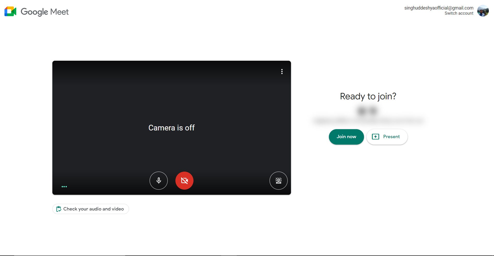
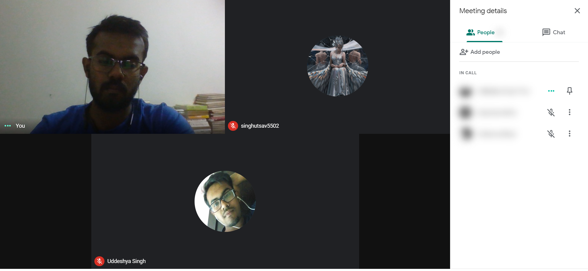
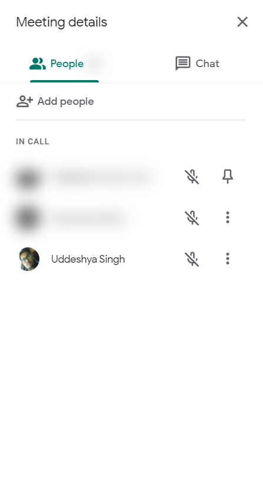
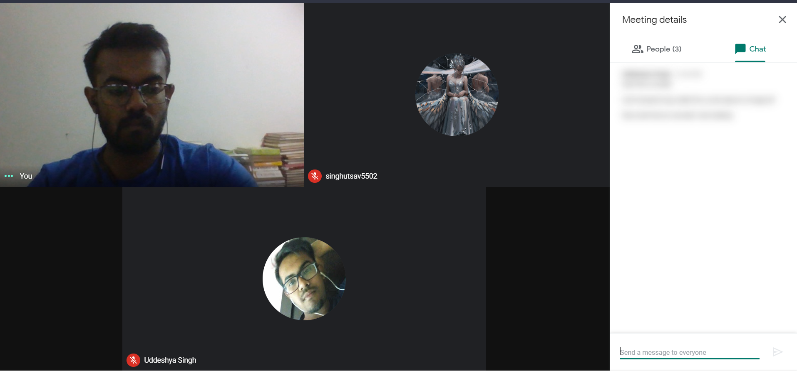
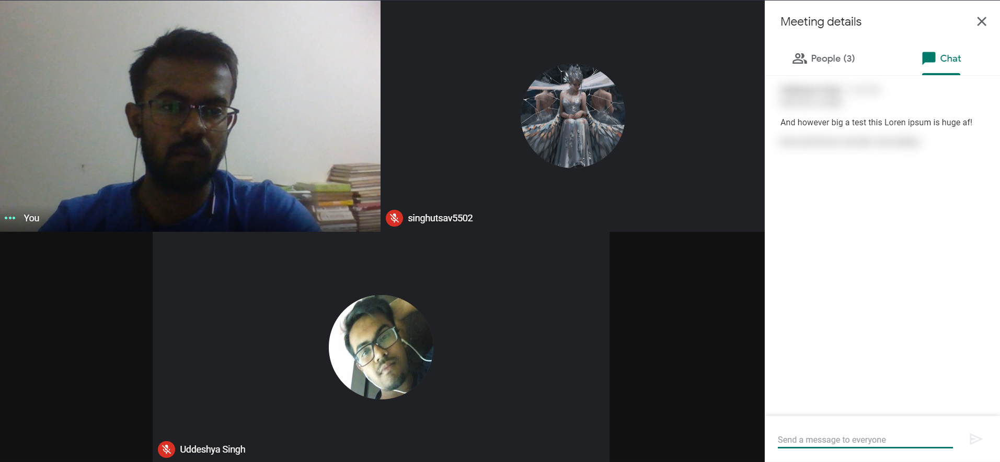
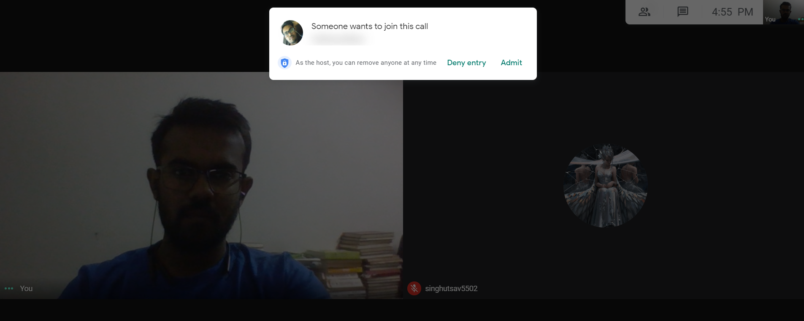
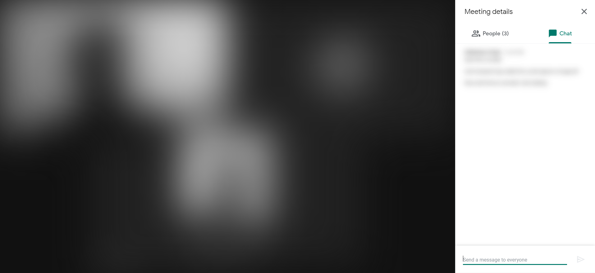

# MeetInPeace

## Too Long, Didn't read? 👍
Anti Snooping browser extension for Google meet, Zoom Meetings Web App and Slack which blurs everything improtant to save your privacy in public and unblurs them on hovering.

## What led to this? 🤔
Somewhere in March 2020, COVID-19 struck the world rendering it motionless and with heavy losses and yada-yada, yes you know what happens after the entire "one man had to eat a bat soup" incident. The point we would like to stress is the rise of work from home culture it brought up.

Folks are working from home more, correct?
*But are folks working from home with an extended safety of privacy?* Not really. 

Imagine a scenario where...
1. **A meeting outside**
- You are working in a cafe or in a metro with your masks and earphones on.
- You are attending a very important meeting with sensitive information on display.
- You are listening to all of it keenly but...
- The people next to you keep staring at your screen and yes, we know, it gets uncomfortable. :)

2. **A call with friends at home**
- You are being yourself with your friends 
- Your friends does something extremely hilarious which well, you probably won't show your folks

Now, you can't really change people can you? 
**But you can definitely change your meeting** ❤️

## The solution 👩‍🏫
**MeetInPeace**, A browser extension which blurs out sensitive information zones in the video calling webapps and reveals them on hovering. see? simple!

## How to setup? ⚙️
1. Download the source code and go to your browser's extension tools. (Mozilla / Chrome / Brave Tested)
2. Turn on Developer mode.
3. Click on Load Unpacked.
4. Select `src/` and let it load.
5. Turn on the main toggle manually by clicking (The toggle next to "Hide Me") or Hit "Alt + Y" to turn on the extension!
6. Focus on meeting without any worries. ✌️

## Story Time! 📖💤 
To illustrate the use of each case, allow us to walk you through a story

*You get a meeting link from work, some client is threatening to go to a competitor and you gotta hop in the call quickly, you get the link and are getting ready for the call.*

*With this extensions **"Entry/Exit"** feature, your client's identity is secured. Now you get in the call and check out the participants of the call one by one all by yourself.*

*and now you hover over the people to unblur them one by one, read who is it who was joined and voila! **Participants** came in handy.*

*Your client pinged in angrily with his quotation complaints, all of them are blurred, thanks to our **Messages** toggle which came in handy thankfully, all you gotta do is hover to the prize.*

*You need help, immediately so you call in your alter ego to handle the situation, but don't want others to know who is hopping in the call? Our extension is out for rescue*

*BEEP BEEP BEEP* 🚨

*A couple of folks are passing through looking at your screen wondering what the hell are you upto, spitting out numbers in that prime fashion and trying to read who all are in the meeting. Toggle **Video** on to deal with this situation* 😉

